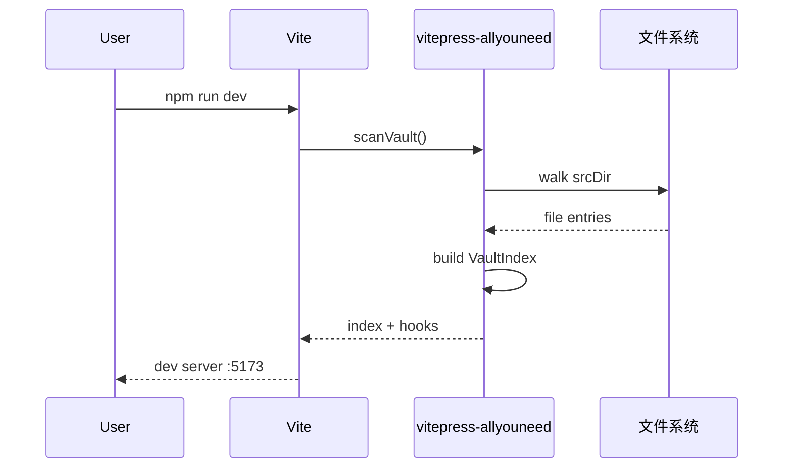
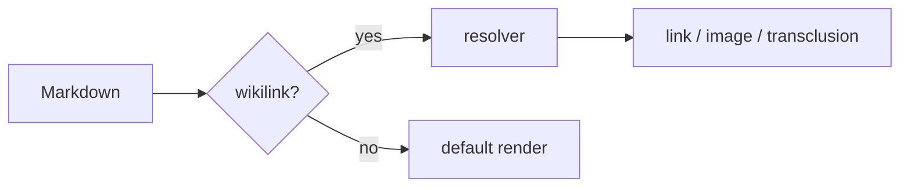

# Mermaid 测试

> [!note] 需要第三方插件
> 本插件**不自带** mermaid 支持。建议装 [`vitepress-plugin-mermaid`](https://github.com/emersonbottero/vitepress-plugin-mermaid):
>
> ```bash
> npm i -D vitepress-plugin-mermaid mermaid
> ```
>
> 然后在 `.vitepress/config.ts` 用 `withMermaid` wrap:
>
> ```ts
> import { withMermaid } from 'vitepress-plugin-mermaid'
> import { defineConfigWithAllYouNeed } from 'vitepress-allyouneed/vitepress'
>
> export default withMermaid(
>   defineConfigWithAllYouNeed({ ... })
> )
> ```

## 时序图



## 流程图



## 如果没装

VitePress 默认会把 ```mermaid 当 fenced code 输出,显示源码。本插件**不干扰**这个行为。
